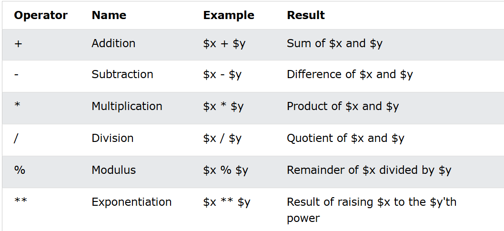
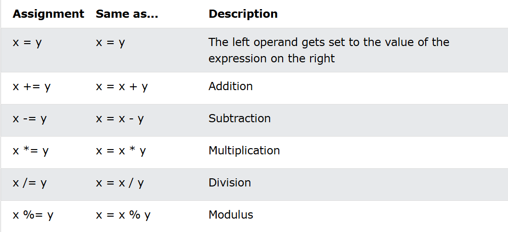
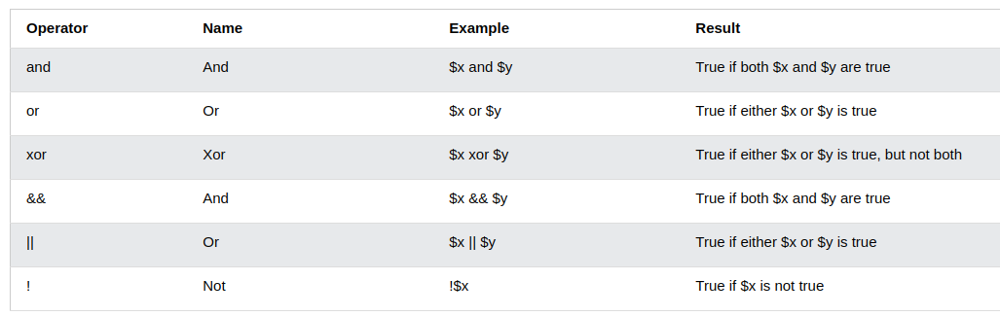
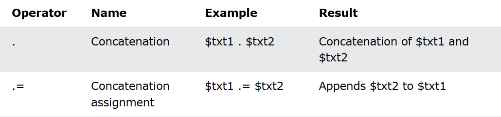
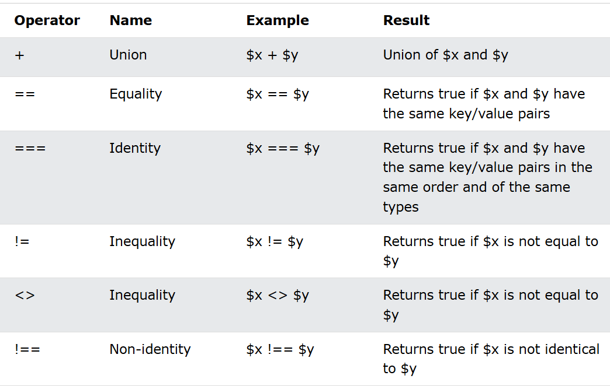
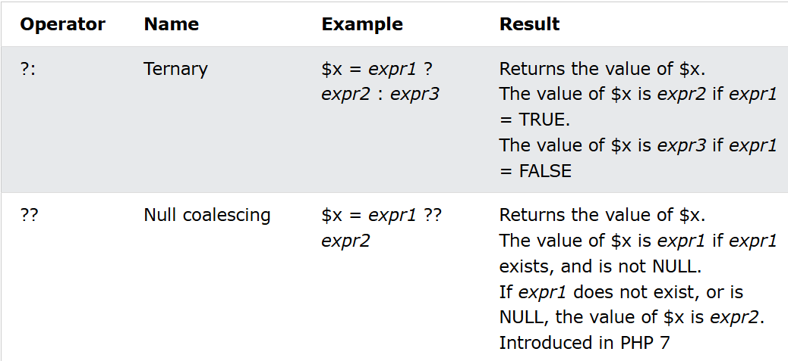

# php-basic

## Introduction to web Technology (Công nghệ Web)
Khái niệm: Công nghệ web là một thuật ngữ chung đề cập đến nhiều ngôn ngữ và gói đa phương tiện được sử dụng kết hợp với nhau, để tạo ra các trang web. Mỗi công nghệ có chức năng riêng biệt và cần yêu cầu sử dụng kép ít nhất thêm một công nghệ khác.

## Introduction to HTML5 and CSS
### HTML5
Khái niệm: HTML5 là phiên bản mới (chuẩn mới) của HTML (Hypertext Markup Language) để trình bày trang web.
Trang HTML5 mặc định giải mã ký tự theo UTF-8
#### Một số cải tiến:
Các phần tử mới: 
footer,header, ...
Cải tiến Form: hỗ trợ kiểu input mới, các phương thức put và delete. Tạo các Form mạnh mẽ hơn.
Có các yếu tố đồ họa mới bao gồm đồ họa vector và tags.
Cho phép vẽ nhiều hình dạng khác nhau như hình tam giác, hình chữ nhật, hình tròn, v.v.
...
#### Thuận lợi:
Hỗ trợ nhiều trình duyệt hơn.
Thân thiện với nhiều thiết bị.
Dễ sử dụng và thực hiện hơn.
Tích hợp với CSS và JS, v.v. có thể xây dựng các trang web tốt hơn.
### CSS
Khái niệm: CSS là một ngôn ngữ chuyên dùng để trình bày hình thức thể hiện của văn bản HTML cho người dùng, như văn bản đó được định dạng ra sao (cơ chữ, font chữ, màu sắc ...), bố cục, dàn trang thế nào ...

CSS viết tắt của cụm từ Cascading Style Sheets, về ngữ nghĩa thì có thể hiểu: Cascading là cách làm việc của CSS, các CSS tác dụng vào phần tử HTML có thể bị đè (định nghĩa lại) bởi CSS khác hoặc kết hợp cùng với CSS khác
Tại sao cần dùng CSS:

Tiết kiệm thời gian: Có thể viết 1 lần và dùng cho nhiều trang.
Bảo trì dễ dàng: Chỉ cần thay đổi nội dung trong file css và tất cả các trang sẽ được cập nhật.
Được coi là 1 kỹ thuật mã hóa sạch.
Có thể xem trên trang ngoại tuyến.

## Introduction PHP
Khái niệm: Thuật ngữ PHP là từ viết tắt của PHP: Hypertext Preprocessor. PHP là một ngôn ngữ kịch bản phía máy chủ được thiết kế đặc biệt để phát triển web.
Là mã nguồn mở nên dễ dàng để tải xuống và sử dụng miễn phí. Tệp có phần mở rộng là ".php".
Là ngôn ngữ thông dịch và thực thi phía máy chủ.
Có thể tích hợp với nhiều CSDL.
Hỗ trợ các giao thức chính như HTTP Basic.
HTML, CSS và JS có thể được nhúng dễ dàng vào file PHP.
Các đặc điểm:
Đơn giản, nhanh chóng, hiệu quả, linh hoạt.
Đa nền tảng, có thể hoạt động trên Linux, Win, MacOS.
Mã nguồn mở.
Thư viện hỗ trợ mạnh mẽ.
Kết nối CSDL.

## Điểm nổi bật:
### 1. JIT (Just-In-Time Compilation)
Tăng hiệu suất thực thi mã PHP, đặc biệt cho các tác vụ tính toán hoặc xử lý logic phức tạp.

Tuy nhiên, với các ứng dụng web thông thường, hiệu suất tăng không quá rõ rệt.
### 2. Union Types
Cho phép khai báo nhiều kiểu dữ liệu cho một biến hoặc tham số:

```php 
function foo(int|float $number) { ... }
```
### 3. Nullsafe Operator (?->)
Tránh lỗi khi truy cập chuỗi object có thể null:
```php
$country = $user?->address?->country;
```
### 4. Named Arguments
Truyền tham số theo tên thay vì theo thứ tự:
```php
function foo($a, $b, $c) { ... }

foo(a: 1, c: 3, b: 2);

```
### 5. Match Expression
Giống switch, nhưng ngắn gọn hơn, hỗ trợ trả giá trị:
```php
$result = match($status) {
    1 => 'Active',
    2 => 'Inactive',
    default => 'Unknown',
};
```
### 6. Throw là một biểu thức
Giờ đây có thể dùng throw trong biểu thức (như toán tử ternary):

php
Sao chép
Chỉnh sửa

```php
$val = $input ?? throw new InvalidArgumentException();
```
### 7. Constructor Property Promotion
Giảm boilerplate trong class khi khai báo thuộc tính:
```php
class User {
    public function __construct(
        public string $name,
        public int $age,
    ) {}
}
```
### 8. Static Return Type và Mixed Type
static có thể dùng làm kiểu trả về, và mixed dùng cho bất kỳ kiểu nào.

# PHP
## Basic PHP Syntax
Tập lệnh PHP có thể đặt ở bất kỳ đâu trong tài liệu.
Nó bắt đầu và kết thúc bằng cặp <?php ?>. Các câu lệnh PHP kết thúc bằng dấu " ; "
Phần mở rộng cho tệp mặc định là ".php"
```php
<?php
    echo "Hello World !";
?>
```
Trong PHP, các từ khóa, các lớp, hàm và các hàm do người dùng tự định nghĩa không phân biệt chữ hoa và chữ thường.
Tất cả các biến đều phân biệt chữ hoa và chữ thường.

## PHP Variables, Constants and Array
### PHP Variables (Biến)
Trong PHP, 1 biến bắt đầu bằng dấu $, theo sau là tên của biến.

Quy tắc cho các biến trong PHP:

Một biến bắt đầu bằng dấu $, theo sau là tên của biến.

Tên biến phải bắt đầu bằng một chữ cái hoặc ký tự gạch dưới.

Tên biến không thể bắt đầu bằng số.

Tên biến chỉ có thể chứa các ký tự chữ-số và dấu gạch dưới (Az, 0-9 và _).

Tên biến có phân biệt chữ hoa chữ thường.

### PHP Constants (Hằng)

Hằng số là một định danh cho 1 simple value và không thể thay đổi giá trị trong tập lệnh và là toàn cục.

Tên hằng hợp lệ bắt đầu bằng 1 chữ cái hoặc dấu gạch dưới (không có $).

Để tạo hằng số, sử dụng hàm define() với cú pháp :
    define(name, value, case-insensitive);
    
    // trong đó name là tên hằng, value là giá trị hằng và case-insensitive để chỉ định phân biệt 
    
    // chữ hoa và chữ thường. Mặc định là có (FALSE).
    
    // có thể sử dụng để tạo hẳng mảng như sau: 
    
    define(arr, [1, 2, 3]);
    
### PHP Array (Mảng)
Mảng

Mảng là một biến đặc biệt, có thể chứa nhiều giá trị cùng 1 lúc.

array() được dùng để tạo 1 mảng trong PHP.
```php
<?php
    $arr = array("Đinh", "Thế", "Anh");
?>
```
Có ba loại mảng:
Mảng chỉ mục - Mảng được lập chỉ mục số.

Mảng liên kết - Mảng có các khóa được đặt tên.

Mảng nhiều chiều - Mảng chứa 1 hoặc nhiều mảng.

#### Mảng được lập chỉ mục

Có 2 cách để tạo mảng được lập chỉ mục:
Chỉ mục có thể được chỉ định tự động (luôn bắt đầu từ 0).
Hoặc chỉ định thủ công:
```php
<?php
    $arr = [];
    $arr[0] = 1;
    $arr[1] = 2;        
?>
```
#### Mảng liên kết

Mảng liên kết là mảng sử dụng các khóa do người dùng đặt tên cho chúng.

Có 2 cách tạo tương tự như mảng được lập chỉ mục:
```php
<?php
    // cách 1
    $arr = array("name" => "The Anh", "age" => 20);
    
    // cách 2
    $arr = [];
    $arr[name] = "The Anh";
    $arr[age] = 20;
?>
```
#### Mảng đa chiều

Mảng đa chiều là mảng mà bên trong đó chứa 1 hay nhiều mảng khác.
Ví dụ ta có 1 mảng 2 chiều như sau:
```php
<?php
    $person = array(
        array("Nguyen Van A", 20),
        array("Nguyen A", 19),
        array("Tran B", 23),
    );
    // để truy cập ta dùng $person[][]
?>
```


## PHP Data Types
### String
String là một chuỗi các ký tự, có thể là bất kỳ văn bản nào bên trong dấu nháy kép hoặc nháy đơn.
```php
<?php
    $string = "this isString";
    echo $string;
    // biến string có kiểu dữ liệu là string với giá trị là "this is String"
?>
```
### Integer
Kiểu số nguyên là một số không thập phân có dải giá trị từ -2,147,483,648 đến 2,147,483,647.
Một số quy tắc với kiểu số nguyên:
Có ít nhất 1 số.
Không được có dấu thập phân.
Có thể là số dương hoặc số âm.
```php
<?php
    $int = 1234;
    // biến int được khai báo kiểu dữ liệu số nguyên với giá trị là 1234
?>
```
### Float
Số dấu phẩy động là một số có dấu thập phân hoặc một số ở dạng hàm mũ.
```php
<?php
    $float_1 = 1.234;
    $float_2 = 1/2;
    // biến float_1 và float_2 được khai báo kiểu dữ liệu float
?>
```
### Boolean
Kiểu dữ liệu Boolean đại diện cho 2 trạng thái TRUE hoặc FALSE.
```php
<?php
    // có thể khai báo kiểu Boolean như sau 
    $x = true;
    $y = false;
?>
```
### Array
Mảng có thể lưu trữ nhiều giá trị trong 1 biến duy nhất.
```php
<?php
    $arr = array("Pham", "Huy", "Hung");
    // biến arr có kiểu dữ liệu dạng mảng với 3 giá trị
?>
```
### Object
Class và Object là khía cạnh thuộc về lập trình hướng đối tượng.
Class là khuôn mẫu cho các Object và một Object là thể hiện của một Class.
Các Object kế thừa tất cả thuộc tính và hành vi của Class nhưng mang những giá trị khác nhau.
```php
<?php
    // khai báo class Person
    class Person{
        // khai báo 2 thuộc tính của class là name và age
        public $name;
        public $age;

        // khai báo hàm khởi tạo của class
        public function __construct($name, $age)
        {
            $this->name = $name;
            $this->age = $age;
        }

        // khai báo phương thức cho class
        public  function getInfo(){
            return $this->name." ".$this->age;
        }
    }

    // khởi tạo object person_1 
    $person_1 = new Person("Hung", 22);
    echo $person_1->getInfo();
?>
```

### PHP Operators (Toán tử)
Toán tử được sử dụng để thực hiện các hoạt động dựa trên các biến và giá trị.
Toán tử trong PHP được chia thành các nhóm :

Toán tử số học:



Toán tử chuyển nhượng:



Toán tử so sánh:


Toán tử tăng giảm:


Toán tử logic:


Toán tử chuỗi:



Toán tử mảng:



Toán tử phân công có điều kiện:



## Control Structures

### if-else statement (Câu lệnh điều kiện)

#### if...else

Thực thi mã với 1 điều kiện đúng và 1 điều kiện sai

```php
<?php
    // cú pháp 
    if (condition) {
        code to be executed if condition is true;
    } else {
        code to be executed if condition is false;
    }
?>
```

#### if...elseif...else

Thực thi mã với nhiều hơn 2 điều kiện

```php
<?php
    // cú pháp
    if (condition) {
        code to be executed if this condition is true;
    } elseif (condition) {
        code to be executed if first condition is false and this condition is true;
    } else {
        code to be executed if all conditions are false;
    }
?>
```

### switch...case

Thực thi chọn một trong nhiều mã

```php
<?php
    $favcolor = "red";
    
    switch ($favcolor) {
      case "red":
        echo "Your favorite color is red!";
        break;
      case "blue":
        echo "Your favorite color is blue!";
        break;
      case "green":
        echo "Your favorite color is green!";
        break;
      default:
        echo "Your favorite color is neither red, blue, nor green!";
    }
?>
```

### PHP Loops (Vòng lặp)
Trong PHP ta có các loại vòng lặp sau:

while

do...while

for

foreach

#### While Loop

Thực thi khối mã miễn là điều kiện đúng:
```php
<?php
    // cú pháp
    while (condition is true) {
      code to be executed;
    }
?>
```

#### Do...While Loop
Luôn luôn thực thi khối mã 1 lần, sau đó kiểm tra điều kiện và lặp nếu điều kiện đúng
```php
<?php
    // cú pháp
    do {
      code to be executed;
    } while (condition is true);
?>
```
#### For Loop
Vòng lặp thực thi khối mã với số lần xác định
```php
<?php
    // cú pháp
    for (init counter; test counter; increment counter) {
        code to be executed for each iteration;
    }
    // ví dụ 
    for ($x = 0; $x <= 10; $x++) {
        echo $x."<br>";
    }
?>
```

#### Foreach Loop
Vòng lặp chỉ hoạt động trong mảng (array) và lặp qua từng key/value trong mảng.

```php
<?php
    // cú pháp
    foreach ($array as $value) {
        code to be executed;
    }
    // ví dụ 
    $arr = [1, 2, 3];
    foreach ($arr as $item){
        echo $item."<br>";
    }
?>
```
### String Functions
12 function xử lý chuỗi được coi là sử dụng phổ biến nhất hiện nay.
#### strlen($string) - Lấy độ dài chuỗi
```php
<?php
    $str = "Dinh The Anh";
    echo strlen($str);
    // 13
?>
```
#### str_word_count($string) - Đếm số từ

```php
<?php
    $str = "Dinh The Anh";
    echo str_word_count($str);
    // 3
?>
```
#### strrev($string) - Đảo ngược chuỗi

```php
<?php
    $str = "Dinh The Anh;
    echo strrev($str);
    // hnA ehT hinD
?>
```

#### strpos($str, $text) - Tìm đoạn $text trong chuỗi

```php
<?php
    $str = "Dinh The Anh";
    echo strpos($str, "Anh");
    // 9
?>
```

#### str_replace($find, $replace, $string) - Thay thế đoạn văn bản trong chuỗi
```php
<?php
    $str = "Dinh The Anh";
    $str_new = str_replace("Anh", "Anh-deptrai", $str);
    echo $str_new;
    // Dinh The Anh-deptrai
?>
```
#### ucwords($string) - Chuyển chữ cái đầu tiên của mỗi từ thành in hoa
```php
$string = "xin chào các bạn";
$result = ucwords($string);
echo $result; // Kết quả: "Xin Chào Các Bạn"

```

#### strtoupper($string) - Chuyển toàn bộ chuỗi thành chữ in hoa
```php
$string = "hello world";
$result = strtoupper($string);
echo $result; // Kết quả: "HELLO WORLD"

```
#### strtolower($string) - Chuyển toàn bộ chuỗi thành chữ in thường
```php
$string = "PHP Là Ngôn Ngữ Mạnh Mẽ";
$result = strtolower($string);
echo $result; // Kết quả: "php là ngôn ngữ mạnh mẽ"
```
#### str_repeat($string, $repeat) - Lặp lại chuỗi
```php
<?php
    $str = "Dinh The Anh";
    echo  str_repeat($str, 10);
    // Dinh The AnhDinh The Anh
?>
```

#### array_keys($array) - Trả về 1 mảng tuần tự các key của mảng
```php
$array = [
    "ten" => "An",
    "tuoi" => 20,
    "lop" => "PHP"
];

$result = array_keys($array);
print_r($result);
/*
Kết quả:
Array
(
    [0] => ten
    [1] => tuoi
    [2] => lop
)
*/
```
#### array_pop($array) - Trả về phần tử cuối cùng của mảng
```php
$array = ["Táo", "Chuối", "Cam"];
$last = array_pop($array);

echo $last; // Kết quả: Cam
print_r($array);
/*
Kết quả:
Array
(
    [0] => Táo
    [1] => Chuối
)
*/

```
#### array_push($array,$var,$var…) - Thêm 1 hoặc nhiều phần tử vào cuối cùng của mảng
```php
$array = ["A", "B"];
array_push($array, "C", "D");

print_r($array);
/*
Kết quả:
Array
(
    [0] => A
    [1] => B
    [2] => C
    [3] => D
)
*/

```
#### array_unshift($array, $var, $var…) - Thêm 1 hoặc nhiều phần tử vào đầu tiên của mảng
```php
$array = ["B", "C"];
array_unshift($array, "A");

print_r($array);
/*
Kết quả:
Array
(
    [0] => A
    [1] => B
    [2] => C
)
*/

```
#### sort($array) - Sắp xếp mảng theo chiều tăng dần (giá trị, không giữ key)
```php
$array = [4, 2, 8, 1];
sort($array);

print_r($array);
/*
Kết quả:
Array
(
    [0] => 1
    [1] => 2
    [2] => 4
    [3] => 8
)
*/

```

#### array_reverse($array) - Đảo ngược mảng
```php
$array = [1, 2, 3, 4];
$result = array_reverse($array);

print_r($result);
/*
Kết quả:
Array
(
    [0] => 4
    [1] => 3
    [2] => 2
    [3] => 1
)
*/

```
#### array_merger($array,$array…) - Gộp 2 hoặc nhiều mảng thành 1 mảng
```php
$array1 = ["a" => "Apple", "b" => "Banana"];
$array2 = ["c" => "Cherry"];
$result = array_merge($array1, $array2);

print_r($result);
/*
Kết quả:
Array
(
    [a] => Apple
    [b] => Banana
    [c] => Cherry
)
*/

```
#### array_search($keyword,$array) - Tìm kiếm giá trị của mảng và trả về nếu có
```php

$array = ["red", "green", "blue"];
$index = array_search("green", $array);

echo $index; // Kết quả: 1
```
#### array_slice($array,$begin,$lenght) - Lấy ra phần tử theo vị trí bắt đầu và số lượng
```php
$array = ["a", "b", "c", "d", "e"];
$result = array_slice($array, 1, 3);

print_r($result);
/*
Kết quả:
Array
(
    [0] => b
    [1] => c
    [2] => d
)
*/

```
#### array_unique($array) - Loại bỏ phần tử trùng nhau trong mảng
```php
$array = [1, 2, 2, 3, 4, 4];
$result = array_unique($array);

print_r($result);
/*
Kết quả:
Array
(
    [0] => 1
    [1] => 2
    [3] => 3
    [4] => 4
)
*/

```
#### array_key_exists($key,$array) - Kiểm tra $key có tồn tại trong mảng không
```php
$array = ["name" => "An", "age" => 21];
if (array_key_exists("name", $array)) {
    echo "Key 'name' tồn tại!";
}
// Kết quả: Key 'name' tồn tại!

```
#### in_array($value,$array) - Kiểm tra $value có tồn tại trong mảng không
```php
$array = ["red", "green", "blue"];
if (in_array("green", $array)) {
    echo "Có màu xanh!";
}
// Kết quả: Có màu xanh!

```
#### is_array($array) - Kiểm tra xem có phải mảng hay không
```php
$data = ["a", "b", "c"];
if (is_array($data)) {
    echo "Đây là mảng.";
}
// Kết quả: Đây là mảng.

```

### File Handling (Thao tác với file)
#### fopen()
Hàm fopen() được dùng để mở 1 tệp với 2 tham số, tham số thứ nhất chứa tên tệp và tham số thứ 2 cho biết chế độ mà tệp cần được mở:
```php
<?php
    $file = fopen("file_name.txt", "w");
?> 
```
“W” - Mở tệp chỉ để ghi. Nếu tệp không tồn tại thì tệp mới được tạo và nếu tệp đã tồn tại thì nội dung của tệp sẽ bị xóa.

“R” - Tệp chỉ được mở để đọc.

“A” - Tệp chỉ được mở để ghi. Con trỏ tệp trỏ đến cuối tệp. Dữ liệu hiện có trong tệp được giữ nguyên.

“W +” - Mở tệp để đọc và ghi. Nếu tệp không tồn tại thì tệp mới được tạo và nếu tệp đã tồn tại thì nội dung của tệp sẽ bị xóa.

“R +” - Tệp được mở để đọc / ghi.

“A +” - Tệp được mở để ghi / đọc. Con trỏ tệp trỏ đến cuối tệp. Dữ liệu hiện có trong tệp được giữ nguyên. Nếu tệp không có ở đó thì tệp mới sẽ được tạo.

“X” - Tệp mới chỉ được tạo để ghi.

#### fread()
Hàm fread() được sử dụng để đọc 1 file đang mở, tham số thứ nhất là tên file cần đọc và tham số thứ 2 chỉ định số byte tối đa cần đọc.
Nếu muốn đọc toàn bộ file ta có thể chỉ định tham số thứ 2 bằng kích thước của file (filesize())

#### fwrite()
Hàm fwrite() có thể tạo mới hoặc nối văn bản vào tệp đang mở. Đối số truyền vào là tên file, đoạn văn bản cần thêm và có thể thêm đối số thứ 3 là độ dài văn bản được ghi chỉ định.
```php
<?php
    $file = fopen("file_name.txt", 'w');
    $text = "Hello world\n";
    fwrite($file, $text);
?> 
```
#### fclose()
Hàm fclose() dùng để đóng tệp. Đối số truyền vào là tên tệp.
Cần đóng tất cả các file sau khi làm việc để tránh 1 file đang mở chạy trên máy chủ và chiếm tài nguyên.